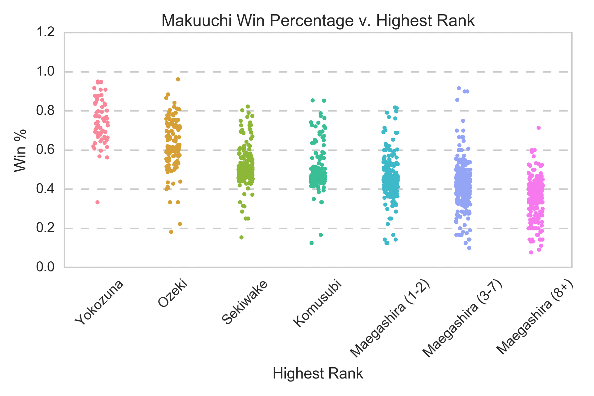

# Sumo Wrestling Machine Learning Project

## Intro
The goal of this project was to use machine learning to **predict the outcomes of sumo wrestling bouts** in Japan Sumo Grand Tournaments. There are few Western attempts at using sports analytics on Eastern sports, and this is an attempt at filling that gap.

## Process
First, I **built a database by scraping and parsing data** from publicly available information at [Sumo Reference] using [Beautiful Soup]. This website contains data on sumo wrestlers, tournament outcomes, etc. dating back to as early as 1600. I scrape basic profile info (e.g. height, weight, rank) as well as head-to-head matches (outcomes of matches between two sumo wrestlers). The resulting database contains **12,374 unique sumo wrestler profiles** and the outcomes of almost **200,000 head-to-head matches** dating back to the early 2000's.

Next, I **visualized the data to observe interesting trends, clean data, and look for features** to include for the machine learning model. Plots were generated using [Seaborn] and saved as PNG's.

Finally, I **trained a logistic regression model on this data** to predict the outcomes of new matches during the 2017 March Grand Tournament (Haru Basho). Current features used are **differences** in the following values between two sumo wrestlers:

   - Height
   - Weight
   - Age
   - Active Number of Years
   - Rank
   - Head-to-Head Win Percentage (of previous matches between two sumos, what percentage of them did one sumo win against the other?)

## Plots

Below are a couple plots I generated. Makuuchi refers to the top division of sumo wrestlers (sumos good enough to compete in the Grand Tournaments).

</img>

We see that the median win percentage is below 50%. A top sumo wrestler will typically lose more than half his matches during his career in the top Makuuchi division. In general, sumo wrestlers will only rise rank if they win more than half their matches during a Grand Tournament. The median win percentage is consistent with the fact that there are fewer spots at higher ranks in the top division.

</img>

We see that weight is not a good predictor of win percentage. This plot exhibits a similar trend to other features such as height, age, and number of active years.

</img>

This plot shows win percentage versus rank (decreasing from left to right). Sumos at higher ranks appear to have higher win rates, but the variation within each rank is quite high, with much overlap across ranks.

## Results

Cross-Validation F1 Score (a measure of accuracy in predicting wins): 57.1%

F1 Score for ~300 unseen matches in 2017 March Grand Tourney: 60.8%

## Lessons Learned

   - Garbage in, garbage out. Even if one has a lot of data to work with, if the features do not capture useful information, then the ML algorithms applied will have no predictive power. The plot below captures this idea well. Even with 50,000 training/test samples, the training and test errors converge well before at approximately 10,000 samples.

</img>

   - It is challenging to beat the betting markets. Using traditional, publicly available data (e.g. head-to-head win percentages, rank, height, weight) is not enough to achieve an accuracy better than betting markets. 

## Future Work

   - Gather more interesting, non-traditional features (e.g. scrape professional sumo's Twitter profiles, visual information from match footage)
   - Perform more work with feature selection
   - Try different classifier algorithms

## Folders

data/  : contains data collected from online, public database using Beautiful Soup Library. Stored as pickle files from pandas dataframes.

plots/ : contains visualizations of data in Seaborn plots saved as png's.

tourneys/ : contains daily tourney head-to-head lineups for March (Haru) Basho 2017.

## Python Scripts and Modules

**data_extraction.py** : Module with helper functions for processing information extracted from html tags using scraping libraries (e.g. Beautiful Soup). 

**database_ops.py** : Module with helper functions to perform various operations with DataFrames.

**feature_generation.py** : Script to generate DataFrame containing feature data and labels.

**filter_duplicates.py** : Script to filter out the duplicate rows in raw head-to-head DataFrame generated by feature generation script.

**machine_learning.py** : Script for doing various machine learning tasks, including model evaluation & predicting outcomes of new bouts.

**ml_fxns.py** : Module with helper functions for various machine learning tasks. Could include data pre-processing tasks, prediction tasks, etc.

**rikishi_scrape.py** : Module with functions used for scraping data with Beautiful Soup. Functions are used when scraping data from multiple html pages/sumo wrestlers.

**scrape_multiple_h2h.py** : Script to scrape head-to-head data for multiple sumo wrestlers.

**scrape_multiple_rikishi.py** : Script to scrape basic profile data for multiple sumo wrestlers.

## Jupyter Notebooks

**ml_playground.ipynb** : notebook for playing around with various machine learning tasks.

**testing_playground.ipynb** : notebook for testing miscellaneous pieces of code.

**visualizations.ipynb** : notebook for generating Seaborn visualizations of scraped data.

[Seaborn]: <https://seaborn.pydata.org/>
[Sumo Reference]: <http://sumodb.sumogames.de/>
[Beautiful Soup]: <https://www.crummy.com/software/BeautifulSoup/bs4/doc/>